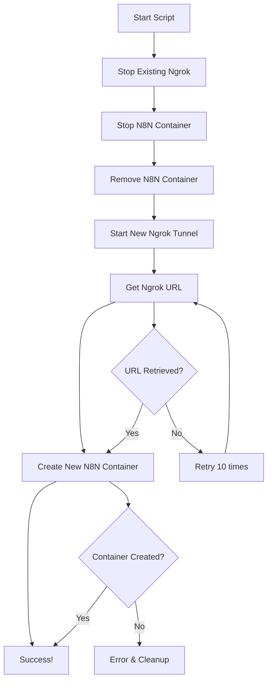

# 🔄 N8N Auto Restart with Ngrok

**Automated PowerShell script to restart N8N with dynamic Ngrok tunneling**

This script automates the complete process of restarting your N8N instance with a fresh Ngrok tunnel, eliminating the need for manual URL configuration.

---

## ✨ Features

- 🚀 **Fully Automated** - One command restart process
- 🔗 **Dynamic URL Extraction** - Automatically gets Ngrok forwarding URL
- 🧹 **Smart Cleanup** - Stops existing processes before starting
- 🎨 **Beautiful Console Output** - Colored, step-by-step progress
- ⚡ **Error Handling** - Robust error management with automatic cleanup
- 🔄 **Complete Reset** - Fresh container with new tunnel URL

---

## 📋 Prerequisites

### Required Software
- **Docker Desktop** - Running and accessible from command line
- **Ngrok** - Installed and available in system PATH
- **PowerShell** - Version 5.0 or higher
- **N8N Docker Image** - `n8nio/n8n`

### System Requirements
- Windows 10/11 or Windows Server
- Internet connection for Ngrok tunneling
- Docker with sufficient resources

---

## 🚀 Quick Start

### 1. Download the Script
Save the script as `restart-n8n-auto.ps1` in your desired directory.

### 2. Set Execution Policy (if needed)
```powershell
Set-ExecutionPolicy -ExecutionPolicy RemoteSigned -Scope CurrentUser
```

### 3. Run the Script
```powershell
.\restart-n8n-auto.ps1
```

---

## 📁 Directory Structure

```
C:\docker\
├── n8n-data\           # N8N data persistence volume
│   ├── restart-n8n-auto.ps1
│   └── workflows\      # Your N8N workflows
└── ...
```

---

## 🛠️ Configuration

### Docker Volume Mapping
The script uses the following volume mapping:
```
-v C:\docker\n8n-data:/home/node/.n8n
```

### Environment Variables Set
- `N8N_HOST=0.0.0.0`
- `N8N_PORT=5678`
- `N8N_PROTOCOL=https`
- `N8N_EDITOR_BASE_URL={ngrok_url}`
- `WEBHOOK_URL={ngrok_url}`
- `VUE_APP_URL_BASE_API={ngrok_url}`
- `N8N_RUNNERS_ENABLED=true`

### Port Configuration
- **Container Port**: 5678
- **Host Port**: 5678
- **Ngrok Tunnel**: Points to localhost:5678

---

## 📊 Script Workflow



---

## 🎯 Usage Examples

### Basic Usage
```powershell
# Simple restart with default settings
.\restart-n8n-auto.ps1
```

### With Custom Timeout
```powershell
# Extend timeout to 45 seconds
.\restart-n8n-auto.ps1 -TimeoutSeconds 45
```

---

## 📱 Console Output Example

```
=======================================================================
 [N8N] N8N AUTOMATIC RESTART PROCESS
=======================================================================

[STEP1] STEP 1: Cleaning up existing ngrok processes
[STOP] Stopping existing ngrok processes...
[OK] Ngrok processes stopped

-----------------------------------------------------------------------

[STEP2] STEP 2: Managing n8n container
[DOCKER] Stopping n8n-main container...
[DOCKER] Removing n8n-main container...
[OK] Container cleanup completed

-----------------------------------------------------------------------

[STEP3] STEP 3: Setting up ngrok tunnel
[START] Starting ngrok tunnel...
[WAIT] Waiting for ngrok to initialize...
[OK] Ngrok tunnel started successfully

-----------------------------------------------------------------------

[STEP4] STEP 4: Retrieving ngrok URL
[INFO] Attempting to fetch ngrok URL (try 1/10)...
[URL] Ngrok URL obtained: https://abc123.ngrok.io

-----------------------------------------------------------------------

[STEP5] STEP 5: Creating new n8n container
[DOCKER] Launching n8n with URL: https://abc123.ngrok.io

=======================================================================
 [SUCCESS] PROCESS COMPLETED SUCCESSFULLY!
=======================================================================

[READY] n8n is now running with URL: https://abc123.ngrok.io
[ACCESS] Access your n8n instance at: https://abc123.ngrok.io

-----------------------------------------------------------------------

[TIP] To stop everything: docker stop n8n-main; Get-Process ngrok | Stop-Process
```

---

## 🔧 Troubleshooting

### Common Issues

#### 1. "ngrok command not found"
**Solution**: Ensure Ngrok is installed and added to your system PATH
```powershell
# Test if ngrok is accessible
ngrok version
```

#### 2. "Docker command not found"
**Solution**: Make sure Docker Desktop is running and CLI is available
```powershell
# Test Docker availability
docker --version
```

#### 3. "Could not obtain ngrok URL"
**Possible causes**:
- Ngrok failed to start
- Port 5678 is blocked
- Internet connection issues

**Solution**: Check Ngrok logs and firewall settings

#### 4. Permission Errors
**Solution**: Run PowerShell as Administrator or adjust execution policy
```powershell
Set-ExecutionPolicy -ExecutionPolicy Bypass -Scope Process
```

### Debug Mode
For debugging, you can manually check Ngrok status:
```bash
# Check Ngrok tunnels
curl http://localhost:4040/api/tunnels
```

---

## 🛑 Manual Cleanup

If the script fails and doesn't clean up properly:

```powershell
# Stop N8N container
docker stop n8n-main
docker rm n8n-main

# Stop Ngrok processes
Get-Process -Name "ngrok" | Stop-Process -Force

# Check running containers
docker ps
```

---

## 🔒 Security Considerations

- 🔐 **Ngrok URLs are public** - Don't expose sensitive data
- 🛡️ **Use authentication** - Configure N8N user authentication
- 🔄 **URLs change** - Each restart generates a new public URL
- 📱 **Free Ngrok limitations** - Consider paid plans for production

---

## 📈 Advanced Configuration

### Custom Data Directory
Modify the volume mapping in the script:
```powershell
-v D:\custom\n8n-data:/home/node/.n8n
```

### Additional Environment Variables
Add more environment variables to the docker run command:
```powershell
-e N8N_LOG_LEVEL=debug `
-e N8N_LOG_OUTPUT=console `
```

---

## 🤝 Contributing

Feel free to submit issues, fork the repository, and create pull requests for any improvements.

### Development Setup
1. Fork the repository
2. Create your feature branch
3. Test thoroughly
4. Submit a pull request

---

## 📄 License

This project is open source and available under the [MIT License](LICENSE).

---

## 📞 Support

- 🐛 **Issues**: Report bugs via GitHub Issues
- 💬 **Discussions**: Join community discussions
- 📖 **Documentation**: Check N8N and Ngrok official docs

---

## 🔗 Related Links

- [N8N Official Documentation](https://docs.n8n.io/)
- [Ngrok Documentation](https://ngrok.com/docs)
- [Docker Documentation](https://docs.docker.com/)
- [PowerShell Documentation](https://docs.microsoft.com/powershell/)

---

**Made with ❤️ for the N8N community**